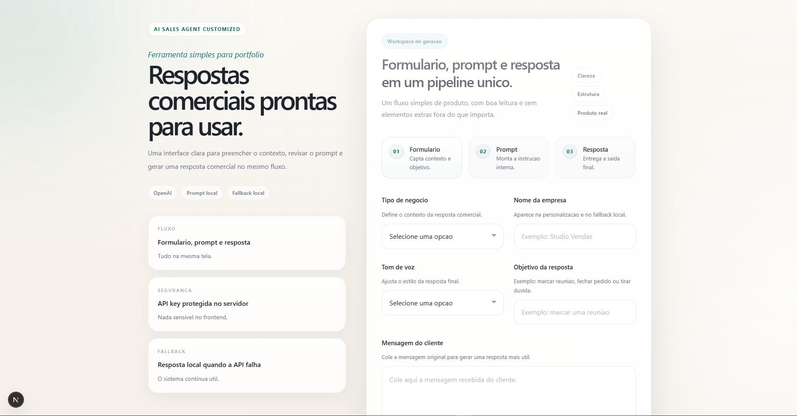
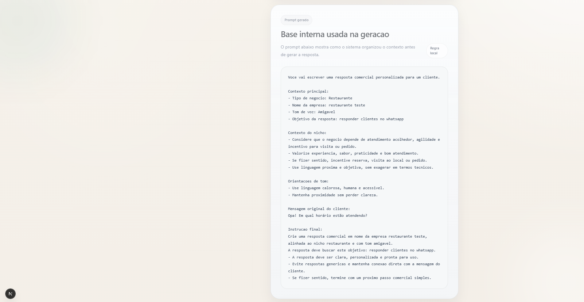
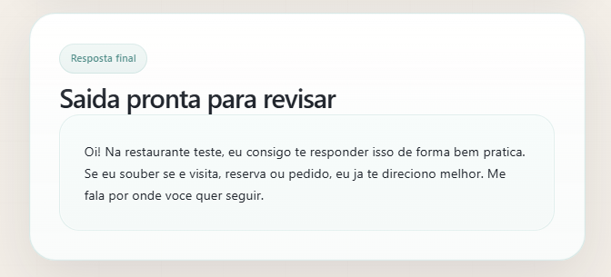

# ai-sales-agent-customized


MVP para gerar respostas comerciais personalizadas por nicho, tom de voz e objetivo de atendimento.

## 🌐 Live Demo

https://ai-sales-agent-customized.vercel.app/

## 📷 Preview do produto

<p align="center">
  
</p>

<p align="center">
  
</p>

<p align="center">
  
</p>

## Visão geral

`ai-sales-agent-customized` é um projeto de portfólio criado para demonstrar, de forma simples e objetiva, como um fluxo com IA pode apoiar atendimento comercial.

A aplicação recebe informações básicas do negócio e da conversa, organiza um prompt interno e retorna uma resposta pronta para uso. Quando a API da OpenAI não está disponível, o sistema continua funcionando com um fallback local.

## Problema que resolve

Muitos atendimentos comerciais começam com mensagens curtas, vagas ou repetitivas, e isso gera dois problemas:

- respostas genéricas, sem contexto do negócio
- demora para responder clientes com clareza e consistência

Este projeto resolve isso com um fluxo enxuto que transforma dados simples em uma resposta comercial mais alinhada ao nicho, ao tom desejado e ao objetivo do atendimento.

## Como funciona

O fluxo principal da aplicação é:

1. O usuário preenche o formulário com:
   - tipo de negócio
   - nome da empresa
   - tom de voz
   - objetivo da resposta
   - mensagem do cliente
2. O sistema gera um prompt interno com regras de personalização por nicho.
3. A rota da API envia esse prompt para a OpenAI.
4. A resposta gerada volta para a interface.
5. Se a API falhar ou não houver chave configurada, o sistema usa um fallback local para manter a experiência funcionando.

```
Formulário → buildSalesPrompt() → POST /api/generate → OpenAI API → Resposta
                                          ↓ (fallback)
                                  buildFallbackResponse()
```

## Valor do projeto

Este projeto foi pensado para mostrar, em um MVP realista:

- uso prático de IA em um contexto comercial
- integração simples e segura com a OpenAI API
- separação clara entre frontend, prompt e rota de servidor
- fallback local para resiliência
- interface de demonstração limpa e fácil de entender

## Diferenciais

- Fluxo simples e direto: formulário → prompt → resposta
- Prompt interno gerado com base no nicho e no tom de voz
- Integração opcional com OpenAI
- Chave da API protegida no servidor
- Fallback local para manter o sistema funcional mesmo sem IA externa
- Estrutura enxuta, ideal para portfólio e estudo

## Stack

- [Next.js](https://nextjs.org/)
- [React](https://react.dev/)
- [TypeScript](https://www.typescriptlang.org/)
- [Tailwind CSS](https://tailwindcss.com/)

## Como rodar localmente

### 1. Instale as dependências

```bash
npm install
```

### 2. Rode o projeto em desenvolvimento

```bash
npm run dev
```

### 3. Acesse no navegador

Abra:

```bash
http://localhost:3000
```

## Variáveis de ambiente

Crie um arquivo `.env.local` na raiz do projeto com:

```env
OPENAI_API_KEY=sua_chave_aqui
```

### Observação

- A chave é opcional para desenvolvimento.
- Se ela não estiver configurada, a aplicação continua funcionando com fallback local.
- A chave nunca é exposta no frontend.

## Uso da OpenAI API

Quando a variável `OPENAI_API_KEY` está disponível:

- a rota `POST /api/generate` recebe os dados do formulário
- o sistema monta o prompt no servidor
- a aplicação envia esse prompt para a OpenAI
- a resposta gerada é devolvida para a interface

Modelo utilizado atualmente:

- `gpt-4o-mini`

## Fallback local

O projeto possui um fallback local para garantir continuidade do fluxo.

Ele entra em ação quando:

- a chave da OpenAI não está configurada
- a API retorna erro
- a resposta da API não vem em formato utilizável

Nesse caso, o sistema gera uma resposta simulada com base em:

- tipo de negócio
- nome da empresa
- tom de voz
- objetivo da resposta
- mensagem do cliente

Isso permite demonstrar o produto mesmo sem depender da API em tempo integral.

## Exemplos de uso

### Exemplo 1: restaurante

**Entrada**

- Tipo de negócio: `restaurante`
- Empresa: `Depanela`
- Tom: `amigavel`
- Objetivo: `converter em reserva`
- Mensagem do cliente: `Que horas vocês abrem hoje?`

**Saída esperada**

Uma resposta curta, acolhedora e comercial, com foco em horário e próximo passo.

### Exemplo 2: clínica

**Entrada**

- Tipo de negócio: `clinica`
- Empresa: `Clínica Vida`
- Tom: `profissional`
- Objetivo: `agendar avaliação`
- Mensagem do cliente: `Vocês fazem avaliação?`

**Saída esperada**

Uma resposta clara, profissional e orientada a agendamento.

### Exemplo 3: oficina

**Entrada**

- Tipo de negócio: `oficina`
- Empresa: `Auto Center Prime`
- Tom: `direto`
- Objetivo: `gerar encaixe`
- Mensagem do cliente: `Meu carro está com barulho no freio, conseguem ver hoje?`

**Saída esperada**

Uma resposta objetiva, com senso de urgência e chamada para encaixe.

## Estrutura principal

```bash
app/
  api/generate/route.ts
  page.tsx
lib/
  buildSalesPrompt.ts
  buildFallbackResponse.ts
```

## 🗺️ Roadmap

- [ ] melhorar a heurística do fallback local
- [ ] adicionar exemplos reais de prompts e respostas
- [ ] incluir testes básicos para a rota e funções de geração
- [ ] permitir configuração de dados do negócio (horário, endereço)
- [ ] versão com persistência para histórico de respostas

## Status

✅ MVP funcional — deploy ativo na Vercel.
